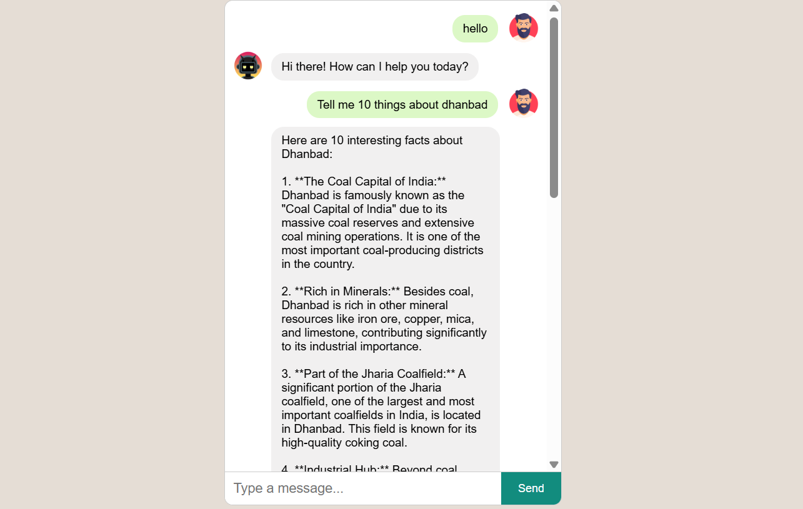

# 💬 Basic WhatsApp-Style Chatbot

A simple chatbot web app with a WhatsApp-style interface.  
Built using **Flask (Python)** and **Gemini API** for AI responses.

---


Then set it as an environment variable:


## 🖥️ Features

* Simple chat UI (WhatsApp style)  
* User messages on the right  
* Bot replies on the left  
* Gemini API integration

---

## 📂 Project Structure

```
chatbot/
├── app.py
├── templates/
│   └── index.html
├── static/
│   └── style.css
└── README.md
```
## Screenshot


